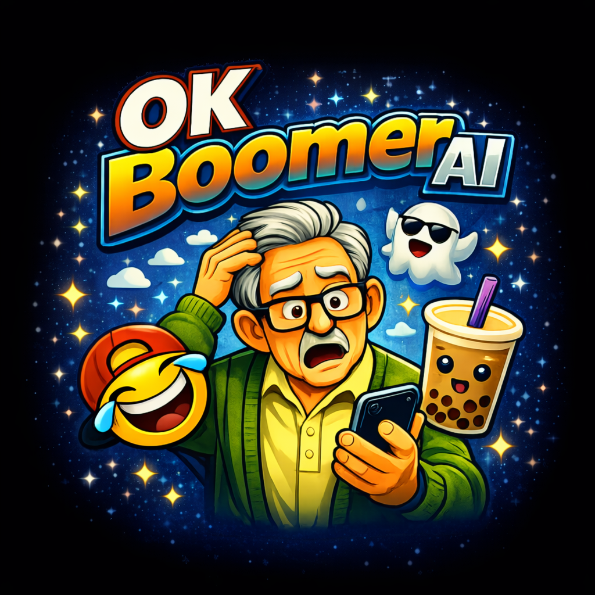
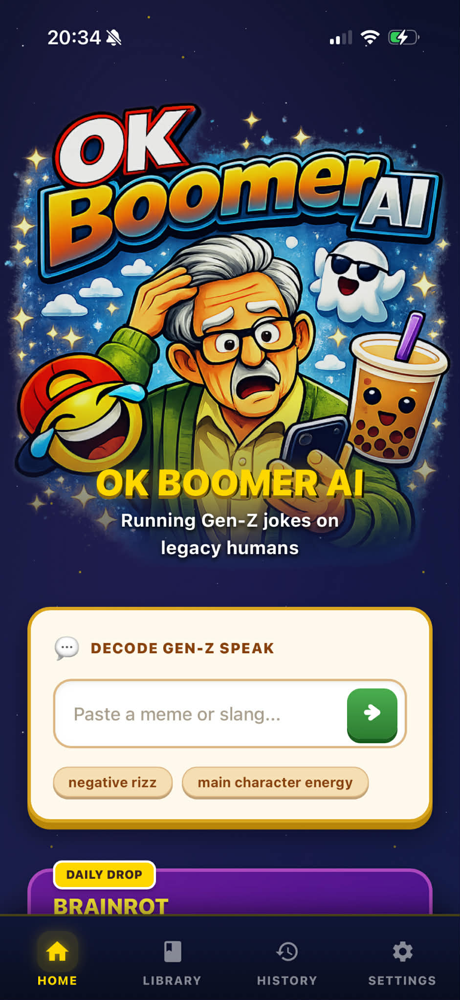
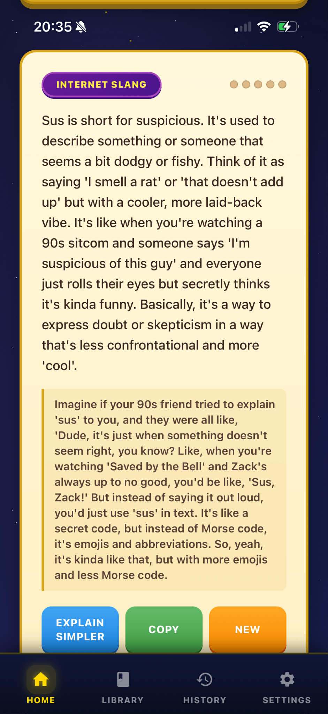
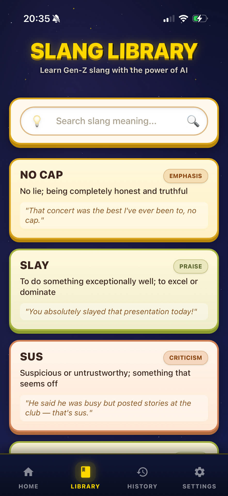
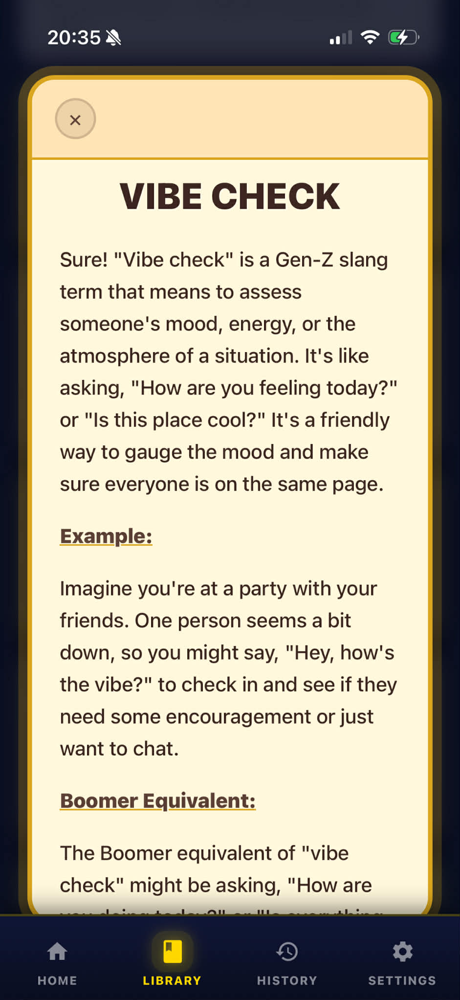
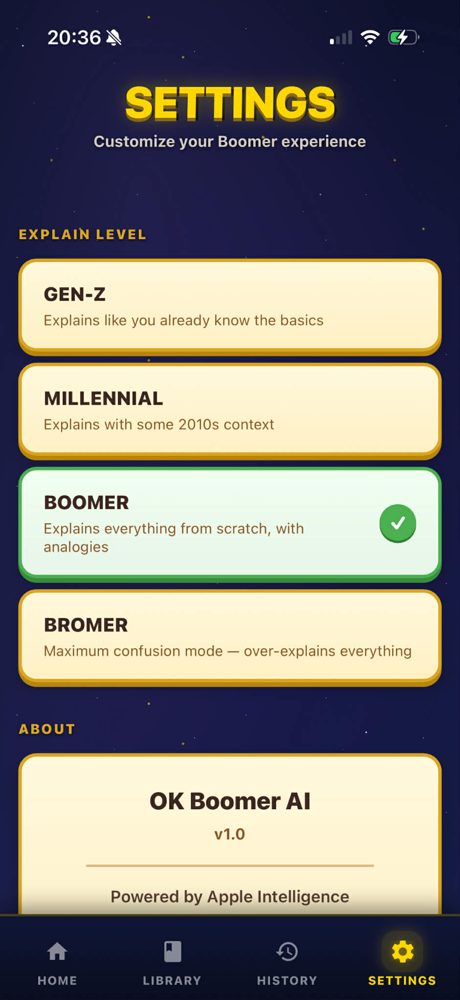

<div align="center">



# 🧓 OK Boomer AI

### Running Gen-Z jokes on legacy humans

**A .NET MAUI Blazor Hybrid app powered by on-device Apple Intelligence**

[](https://dotnet.microsoft.com/)
[](https://learn.microsoft.com/dotnet/maui/)
[](https://github.com/dotnet/maui/pull/33519)
[](LICENSE)

<br/>

*Can't tell if your grandkid is roasting you or complimenting you? Let AI explain it.*

<br/>

    

</div>

---

## 🤖 What is this?

**OK Boomer AI** is a humorous .NET MAUI mobile app that explains modern memes, slang, and internet jokes to people who are "too old" to understand them. It demonstrates **on-device AI reasoning and semantic understanding** using the brand new [**Microsoft.Maui.Essentials.AI**](https://github.com/dotnet/maui/pull/33519) package — Apple Intelligence running entirely on your device.

> **🔒 100% Private** — All AI processing happens on-device using Apple's foundation models. No data leaves your phone. Ever.

## ⚡ Built with Microsoft.Maui.Essentials.AI

This app is a showcase for the new **Apple Intelligence integration in .NET MAUI**, introduced in [dotnet/maui#33519](https://github.com/dotnet/maui/pull/33519):

| API | What it does in OK Boomer AI |
|-----|-----|
| **`AppleIntelligenceChatClient`** (`IChatClient`) | Powers all slang explanations, translations, and quiz generation — on-device, private, and fast |
| **`NLEmbeddingGenerator`** (`IEmbeddingGenerator`) | Enables semantic search in the Slang Library — find slang by meaning, not just keywords |

These APIs bring Apple's on-device foundation models to .NET developers through the familiar `Microsoft.Extensions.AI` abstractions. Write once, swap models later.

## 📱 Features

### 🏠 Decode Gen-Z Speak
Paste any meme, slang, or internet joke and get an AI-powered explanation with:
- **Category tagging** (Internet Slang, Meme, TikTok Trend, etc.)
- **Confusion meter** — how baffling is this for a boomer? (1-5 scale)
- **Humor notes** — why Gen-Z thinks this is funny
- **"Explain Simpler"** button for maximum boomer mode

### 📚 Slang Library
Browse 50+ curated Gen-Z slang terms with:
- **Semantic search** powered by `NLEmbeddingGenerator` — search by meaning, not just text
- **Color-coded categories** — dating, humor, praise, criticism, and more
- **AI explanations** — tap any term for a deep-dive generated by Apple Intelligence

### 📋 History
All your decoded memes saved for later reference. Tap to revisit full explanations.

### ⚙️ Explain Level
Choose your confusion level:
- **Gen-Z** — assumes you know the basics
- **Millennial** — adds 2010s context  
- **Boomer** — explains everything from scratch with analogies
- **Bromer** — maximum confusion mode, over-explains everything

## 🏗️ Architecture

```
OkBoomerAI/
├── Components/
│   ├── Layout/MainLayout.razor    # Tab bar navigation with SVG icons
│   └── Pages/
│       ├── Home.razor             # Main decoder with loading animations
│       ├── Dictionary.razor       # Slang library with semantic search
│       ├── History.razor          # Saved explanations
│       └── Settings.razor         # Explain level configuration
├── Services/
│   ├── IChatService.cs            # Chat abstraction over IChatClient
│   ├── AppleIntelligenceChatService.cs  # Apple Intelligence implementation
│   ├── IEmbeddingService.cs       # Embedding abstraction
│   ├── EmbeddingService.cs        # NLEmbeddingGenerator implementation
│   ├── HistoryService.cs          # In-memory history tracking
│   ├── Prompts.cs                 # Randomized prompt templates
│   └── SlangDataService.cs        # Slang dictionary data loader
├── Models/
│   ├── SlangEntry.cs              # Slang term model
│   └── JokeExplanation.cs         # AI response model
└── wwwroot/
    └── app.css                    # Game-inspired UI theme
```

## 🎨 Design

The app features a **game-inspired visual design** with:
- 🌌 Animated starfield background with twinkling gold stars
- 📜 Parchment-textured cards with gold borders and 3D shadows
- 🎮 Pressable buttons with depth effects
- 🌈 Color-coded category system for slang terms
- ✨ Shimmer loading animations

## 🚀 Getting Started

### Prerequisites
- [.NET 10 Preview](https://pkgs.dev.azure.com/dnceng/public/_packaging/dotnet10/nuget/v3/index.json)
- Xcode 26+ (for Apple Intelligence APIs)
- macOS with Apple Silicon (M1+) or iPhone with A17 Pro+

### Setup

```bash
# Clone the repo
git clone https://github.com/kubaflo/OkBoomerAI.git
cd OkBoomerAI

# Add .NET 10 nightly feed (if not already configured)
dotnet nuget add source https://pkgs.dev.azure.com/dnceng/public/_packaging/dotnet10/nuget/v3/index.json --name dotnet10

# Build and run on iOS Simulator
dotnet build -f net10.0-ios -r iossimulator-arm64
xcrun simctl install booted bin/Debug/net10.0-ios/iossimulator-arm64/OkBoomerAI.app
xcrun simctl launch booted com.hackathon.okboomerai

# Or run on Mac Catalyst
dotnet build -f net10.0-maccatalyst
open bin/Debug/net10.0-maccatalyst/maccatalyst-arm64/OK\ Boomer\ AI.app
```

## 🏆 Built for MEAI Hackathon 2026

This app was created during the **MEAI in .NET MAUI Hackday** (March 6, 2026) to test, experiment with, and showcase the new [Apple Intelligence APIs in .NET MAUI](https://github.com/dotnet/maui/pull/33519).

**Hackday Challenge Level: 🟢 Basic + 🟡 Advanced**
- ✅ On-device AI with `AppleIntelligenceChatClient`
- ✅ Semantic embeddings with `NLEmbeddingGenerator`
- ✅ Structured JSON responses from on-device models
- ✅ Privacy-first — all AI runs locally

## 📄 License

MIT — do whatever you want with it, boomer.
